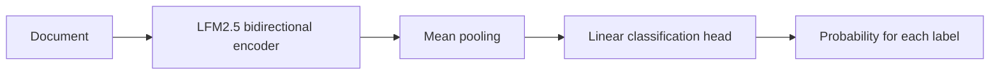

# Fine-tune LFM2.5-Encoder for document classification

[](https://discord.gg/YrtBx8mmt)
[](https://x.com/liquidai)
[](https://www.linkedin.com/company/liquid-ai-inc/)

Fine-tune
[`LiquidAI/LFM2.5-Encoder-230M`](https://huggingface.co/LiquidAI/LFM2.5-Encoder-230M)
or [`LiquidAI/LFM2.5-Encoder-350M`](https://huggingface.co/LiquidAI/LFM2.5-Encoder-350M)
to classify long documents into one or more categories.

This example gives you a reusable pipeline for multi-label classification: point a YAML file at
your data, fine-tune the bidirectional encoder, tune decision thresholds on validation data, and
evaluate once on a held-out test split.

The included synthetic support-ticket dataset provides a ready-to-run example of the expected data
format. Point the configuration at your own data to train a classifier for your task.

## What you will build



LFM2.5-Encoder is pretrained using masked language modeling. This tutorial keeps its bidirectional
backbone, leaves the masked-token prediction head unused, mean-pools the contextual token
representations, and trains one linear output per label. Mean pooling is a task-specific choice in
this tutorial. The model returns every label score in one forward pass—there is no text generation
or output parsing.

The workflow uses two executable scripts:

```text
train.py    Fine-tune, validate, tune thresholds, and optionally evaluate test
predict.py  Classify one document with the saved model
```

## Quickstart

Run everything from this directory:

```bash
cd cookbook/examples/lfm-encoder-classification
uv sync
```

On the first run, Transformers downloads the model weights, tokenizer, configuration, and custom
model code from Hugging Face. Authentication is only needed when the model repository requires it:

```bash
cp .env.example .env
# Add your HF_TOKEN to .env if authentication is required.
```

## 1. Prepare your data

Create training, validation, and test JSONL files. Each line needs a document and a list of labels:

```json
{"text":"The application fails when I upload a file.","labels":["technical"]}
{"text":"I was charged twice and my order has not shipped.","labels":["billing","shipping"]}
```

`text` may be a string or a list of paragraph strings. A document may have several labels—or an
empty list when none apply.

The repository includes a purpose-built synthetic dataset under [`sample_data/`](./sample_data/).
Use it to inspect the expected format and verify the complete pipeline before switching to your
training data.

## 2. Configure the task

Edit [`config.yaml`](./config.yaml):

```yaml
model:
  id: LiquidAI/LFM2.5-Encoder-350M

dataset:
  source:
    type: json
    data_files:
      train: sample_data/train.jsonl
      validation: sample_data/validation.jsonl
      test: sample_data/test.jsonl
  text_column: text
  labels_column: labels
  labels: [account, billing, shipping, technical]

training:
  output_dir: local/classifier
  max_length: 512
  epochs: 3
  learning_rate: 2.0e-5
  precision: fp32
```

Choose the encoder size with `model.id`. The 230M model uses less memory and offers faster training
and inference, while the 350M model provides more capacity. Both support an 8,192-token context and
work with the same training code:

```yaml
# Lower memory and faster execution
model:
  id: LiquidAI/LFM2.5-Encoder-230M
```

The default configuration uses the 350M model. It is also the model used for the ECtHR results
reported below.

The default [`config.yaml`](./config.yaml) uses the included synthetic data. For a realistic
long-document fine-tuning example, the included [`config.ecthr-a.yaml`](./config.ecthr-a.yaml) uses
[`coastalcph/lex_glue`](https://huggingface.co/datasets/coastalcph/lex_glue), configuration
`ecthr_a`. ECtHR Task A maps the factual paragraphs of a European Court of Human Rights case to the
Convention articles that the court found were violated.

Load it by changing the dataset section of the configuration:

```yaml
dataset:
  source:
    type: huggingface
    id: coastalcph/lex_glue
    name: ecthr_a
  text_column: text
  labels_column: labels
  labels: ["2", "3", "5", "6", "8", "9", "10", "11", "14", "P1-1"]
```

```bash
uv run train.py --config config.ecthr-a.yaml
```

The dataset is public, licensed CC BY 4.0, and contains 9,000 training, 1,000 validation, and 1,000
test documents. Its documents are lists of paragraph strings and its labels are numeric Hugging
Face `ClassLabel` IDs; the loader joins the paragraphs and converts the IDs to article names before
creating the multi-hot targets.

For another compatible Hugging Face dataset, configure its source:

```yaml
source:
  type: huggingface
  id: your-organization/your-dataset
  name: optional-dataset-configuration
```

Changing only the source works when the dataset has `train`, `validation`, and `test` splits, its
text column contains strings or lists of paragraph strings, and its label column contains either
string label lists or Hugging Face `ClassLabel` ID lists. For another schema, adapt the dataset to
that format first and set `text_column`, `labels_column`, and `labels` accordingly.

## 3. Fine-tune

```bash
uv run train.py --config config.yaml
```

[`train.py`](./train.py) is organized as a readable, top-to-bottom tutorial:

1. Load and validate the YAML configuration and dataset.
2. Define multi-label metrics and validation-only threshold tuning.
3. Keep the pretrained encoder backbone, leave its masked-token prediction head unused, and add
   mean pooling plus a linear classifier.
4. Tokenize, fine-tune, select the best validation checkpoint, and save the result.

Training uses binary cross-entropy with logits. The best checkpoint is selected using validation
average precision, which does not depend on a decision threshold. After training, the script uses
validation predictions to compare a fixed `0.5` threshold, one tuned global threshold, and tuned
per-label thresholds.

The output is saved under `local/classifier/` and includes the model, tokenizer, validation metrics,
and selected thresholds. `local/` is excluded from Git.

## 4. Evaluate on test

Do not use test metrics to choose hyperparameters or thresholds. Once the training configuration is
final, train it and evaluate test once:

```bash
uv run train.py --config config.yaml --evaluate-test
```

The script restores the best validation checkpoint, applies the thresholds selected on validation,
and writes `local/classifier/test_results.json`.

## 5. Classify a document

```bash
uv run predict.py \
  --config config.yaml \
  --text "My payment was accepted, but the order has not shipped."
```

You can also pass a text file:

```bash
uv run predict.py --config config.yaml --file path/to/document.txt
```

The result contains the selected labels and the probability assigned to every label.

## Long documents and GPU memory

Start at 512 or 2,048 tokens before increasing the context length. For 8,192-token full fine-tuning
on a CUDA GPU with bf16 support:

```yaml
training:
  max_length: 8192
  precision: bf16
  gradient_checkpointing: true
```

Gradient checkpointing reduces activation memory but makes training slower. The compact encoder may
run locally at inference time, while full long-context fine-tuning can still require a high-memory
GPU.

## Metrics

The tutorial reports micro and macro precision, recall, F1, average precision, exact-match accuracy,
hamming loss, and per-label metrics. Micro metrics summarize all decisions; macro and per-label
metrics expose poor performance on rare categories.

As a reference, the 350M model with the included ECtHR configuration reached **0.8060 validation
micro-F1** after per-label threshold tuning. On the held-out test split it reached **0.7913
micro-F1**, **0.7062 macro-F1**, and **0.8400 micro average precision**; test micro-F1 at the fixed
`0.5` threshold was **0.7815**. The run used an 8,192-token context, a `3e-5` learning rate, three
epochs, and seed 42. These results are from one seed. The example includes the reproducible
configuration, while legal documents and trained checkpoints remain in their original sources or
generated output directories.

## Optional: keep the model download local

For an offline training environment, download the base model once and point the configuration at it:

```bash
uv run hf download LiquidAI/LFM2.5-Encoder-350M --local-dir local/base-model
```

Use `LiquidAI/LFM2.5-Encoder-230M` in the same command to download the smaller model instead.

```yaml
model:
  id: LiquidAI/LFM2.5-Encoder-350M
  local_path: local/base-model
```

## Development

```bash
make lint
make format
```

## Need help?

Join the [Liquid AI Discord Community](https://discord.gg/YrtBx8mmt) and ask.
