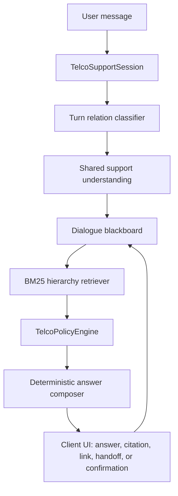
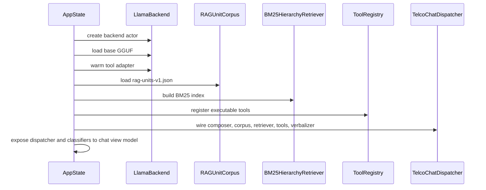
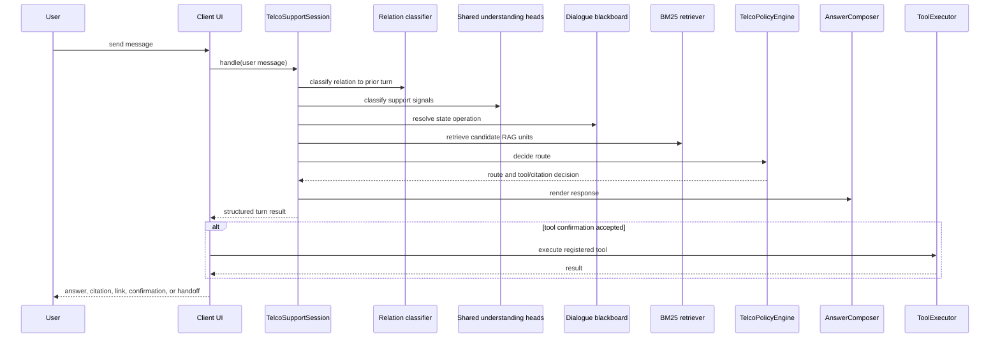

# Telco Triage iOS Architecture Walkthrough

Telco Triage is a SwiftUI reference application for an on-device home internet
support assistant. It demonstrates how a carrier support app can answer common
home-network questions, cite local support material, offer safe local actions,
and deflect only when a request requires account systems, live network state, or
a human agent.

The important design choice is that the model does not directly write policy or
invent support answers. The model produces compact understanding signals. The
app owns retrieval, routing, tool safety, citations, and final answer
composition.

## Audience

This document is for engineering teams integrating the Telco Triage pattern into
an existing iOS app. It explains the architecture and the pieces to port. It is
not a production SDK contract; it is a reference implementation intended to make
the on-device architecture concrete.

## Design Goals

- Keep common support turns on device.
- Ground answers in a local support corpus.
- Preserve citations and source navigation.
- Treat tool execution as a typed, confirmed app action.
- Maintain multi-turn context without letting stale context override a new task.
- Deflect account, billing, unsupported, unsafe, or human-required turns.
- Keep customer-facing behavior deterministic and auditable.

## Non-Goals

- The app is not a replacement for a carrier's backend systems.
- The app does not execute unsupported account or network operations.
- The normal support-answer path does not use free-form generation to invent an
  answer.
- The demo UI is not required for integration into a production app.

## High-Level Runtime Flow



In words:

1. The user sends a message.
2. The app checks whether the turn is a new task, a follow-up, a repair turn,
   a confirmation, or an escalation.
3. A shared on-device classifier reads the message into support-specific labels.
4. The dialogue blackboard updates the active task and pending actions.
5. The retriever finds candidate support units from the local corpus.
6. `TelcoPolicyEngine` chooses one route.
7. `DeterministicAnswerComposer` renders the final response from selected
   evidence and policy.
8. The UI shows a local answer, source chip, deep link, confirmation card, or
   handoff/deflection.

## Layer Map

| Layer | Responsibility | Representative paths |
| --- | --- | --- |
| App shell | Dependency graph, tabs, app mode, shared state | `TelcoTriage/App/TelcoTriageApp.swift`, `TelcoTriage/App/RootView.swift` |
| Chat surface | User input, streaming events, pending confirmations, source chips | `TelcoTriage/Features/Chat/` |
| Model runtime | One loaded base model, LoRA adapter application, classifier heads, embeddings/generation primitives | `TelcoTriage/Core/Model/`, `Packages/LFMEngine/Sources/LFMEngine/` |
| Understanding | Support intent, routing lane, required tool, cloud need, safety, transcript quality | `TelcoTriage/Core/Intelligence/TelcoSharedUnderstanding*.swift` |
| Turn relation | Multi-turn relation labels such as continuation, repair, confirmation, topic switch, handoff | `TelcoTriage/Core/Intelligence/Understanding/TelcoTurnRelationV4Strategy.swift` |
| Dialogue state | Active task, prior evidence, repair attempts, pending tool confirmation | `TelcoTriage/Core/Intelligence/Understanding/TelcoDialogueBlackboard.swift`, `ConversationState.swift` |
| Retrieval | Local corpus loading and BM25 hierarchy ranking | `TelcoTriage/Core/RAG/`, `TelcoTriage/Core/Retrieval/BM25HierarchyRetriever.swift` |
| Policy | Single owner for route selection, safety, handoff, tool gating, and fallback behavior | `TelcoTriage/Core/Intelligence/TelcoPolicyEngine.swift` |
| Composer | Deterministic response rendering from selected route and evidence | `TelcoTriage/Core/Composer/AnswerComposer.swift` |
| Tools | Typed app actions, confirmation policy, and execution result handling | `TelcoTriage/Core/Tools/`, `TelcoTriage/Core/Routing/ToolAliasMap.swift` |
| Optional surfaces | Voice, vision, packs, personalization, metrics, engineering traces | `TelcoTriage/Core/Voice/`, `Core/Vision/`, `Features/` |

## Key Principle: Model for Understanding, Swift for Policy

The application separates model output from product control flow.

The model is used for:

- Support intent classification.
- Required tool classification.
- Cloud/handoff requirement classification.
- Safety and PII risk classification.
- Turn relation classification.
- Optional bounded dialogue repair wording.

Swift policy owns:

- Whether the turn can be answered locally.
- Which RAG unit is selected.
- Whether a tool is actually available.
- Whether confirmation is required.
- Whether to deflect to cloud/account systems.
- Whether to escalate to a human.
- Which citation/source chip is shown.
- Final answer structure.

This keeps the customer-facing path auditable: a generated phrase can improve
tone, but it cannot choose a source, execute a tool, or override safety policy.

## Model Runtime

The reference app uses a single local base model plus small task adapters and
classifier heads.

Required for the normal text-support path:

| Artifact | Purpose |
| --- | --- |
| `lfm25-350m-base-Q4_K_M.gguf` | Base LFM2.5-350M model. |
| `telco-shared-clf-v1.gguf` | Shared support-understanding adapter. |
| `telco-*_classifier_{weights,bias,meta}` | Classifier heads for support intent, issue complexity, routing lane, cloud requirements, required tool, escalation risk, PII risk, transcript quality, and slot completeness. |
| `telco-turn-relation-v4.gguf` | Stateful relation adapter for multi-turn behavior. |
| `telco-turn-relation_classifier_{weights,bias,meta}` | Classifier head for turn relation. |
| `telco-tool-selector-v3.gguf` | Helper adapter for local tool/action paths. |
| `telco-dialogue-repair-v4.gguf` | Optional bounded verbalizer for selected repair/follow-up turns. |

The app loads one `LlamaBackend` actor for the session. Adapter application and
the following forward pass are treated as one actor-isolated operation, so one
task cannot swap an adapter between another task's `setAdapter` and inference
call.

Relevant files:

- `TelcoTriage/Core/Model/LlamaAdapterBackend.swift`
- `TelcoTriage/Core/Model/AdapterInferenceBackend.swift`
- `Packages/LFMEngine/Sources/LFMEngine/OnDevice/LlamaBackend.swift`
- `Packages/LFMEngine/Sources/LFMEngine/OnDevice/ClassifierHead.swift`

## Dependency Model

The cookbook app is intentionally self-contained. `project.yml` vendors the
local `LFMEngine` source into the app target so the example can be copied into
another workspace without requiring a larger monorepo.

Swift package dependencies in the reference project:

| Dependency | Version | Required for |
| --- | --- | --- |
| `https://github.com/mattt/llama.swift.git` | `2.8851.0` exact | On-device text model, LoRA adapter hot-swap, classifier forward pass. |
| `https://github.com/ml-explore/mlx-swift-lm.git` | `2.30.6` exact in project | Optional vision-language surfaces. Not required for text-only support if those files are removed. |
| `https://github.com/Liquid4All/leap-ios.git` | `0.9.4` or later | Optional audio/voice pack path. Not required for text-only support if voice is removed. |

For a text-only integration, the core dependency is the llama.cpp-backed
`LFMEngine` path plus the Telco intelligence/RAG/policy/composer code. Voice
and vision dependencies are optional demo capabilities.

## Corpus and Retrieval

The current answer path uses a structured local corpus:

- `TelcoTriage/Resources/rag-units-v1.json`
- `TelcoTriage/Resources/page-link-table-v1.json`

Each RAG unit is a product-facing support unit with fields such as:

- `page_id`
- `title`
- `section`
- `aliases`
- `steps`
- `body`
- `link_id`
- `canonical_url`
- `action_affordance`

`RAGUnitCorpus` loads the corpus once at startup. `BM25HierarchyRetriever`
performs lexical and alias-aware ranking. This was chosen for the curated,
closed-domain support corpus because exact support-page naming and action
aliases matter more than broad semantic similarity.

Relevant files:

- `TelcoTriage/Core/RAG/RAGUnit.swift`
- `TelcoTriage/Core/RAG/RAGUnitCorpus.swift`
- `TelcoTriage/Core/Retrieval/BM25HierarchyRetriever.swift`

## Policy Engine

`TelcoPolicyEngine` is the single owner of route decisions.

It consumes:

- Turn relation.
- Shared understanding labels.
- Dialogue state.
- Retrieval candidates.
- Selected RAG unit.
- Tool registry.
- Tool alias map.

It returns one `ComposerRoute`, such as:

- Grounded answer.
- Answer plus available action.
- Tool confirmation.
- Clarification.
- Account/cloud deflection.
- Out-of-scope refusal.
- Live-agent handoff.

The route lattice is ordered by cost of error. Sensitive-data safety and human
handoff outrank local answers. Grounded answers outrank vague deflection when a
valid local support unit exists.

Relevant file:

- `TelcoTriage/Core/Intelligence/TelcoPolicyEngine.swift`

## Deterministic Composer

The normal answer layer is `DeterministicAnswerComposer`, not an open-ended
chat generation call.

The composer receives:

- The policy route.
- The selected RAG unit.
- Tool availability.
- Citation/link metadata.
- Dialogue state hints.

It renders:

- A short answer.
- Step lists when appropriate.
- Key details when appropriate.
- Source metadata.
- Confirmation copy only when a real registered tool exists.

Relevant files:

- `TelcoTriage/Core/Composer/AnswerComposer.swift`
- `TelcoTriage/Core/Composer/ComposerRoute.swift`
- `TelcoTriage/Core/Composer/ComposedAnswer.swift`

## Multi-Turn State

Multi-turn behavior is split into two pieces:

1. A relation classifier predicts how the current turn relates to prior state.
2. The blackboard resolves that relation into explicit dialogue state updates.

Examples:

| User sequence | Expected state behavior |
| --- | --- |
| "How do I restart my router?" then "Can you help me?" | Continue active restart-router task. |
| "How do I restart my router?" then "Can you do it for me?" | Offer the registered restart-router confirmation. |
| "How do I restart my router?" then "What is my network SSID?" | Start a new independent task. |
| "I can't find it" after a support answer | Reuse active evidence and guide repair. |
| Repeated failed repair attempts | Escalate rather than repeat the same guidance indefinitely. |

Relevant files:

- `TelcoTriage/Core/Intelligence/Understanding/TelcoTurnRelationV4Strategy.swift`
- `TelcoTriage/Core/Intelligence/Understanding/TelcoDialogueBlackboard.swift`
- `TelcoTriage/Core/Intelligence/Understanding/TelcoStateOperation.swift`
- `TelcoTriage/Core/Intelligence/Understanding/ConversationState.swift`
- `TelcoTriage/Core/Intelligence/MultiTurnHeuristics.swift`

## Tool Safety

Tools are typed app capabilities. A RAG unit may describe an action, but the app
only offers a confirmation if the action maps to a registered tool.

The safety gate is:

```text
RAG unit link_id
    -> ToolAliasMap
    -> ToolIntent
    -> ToolRegistry.tool(for:)
    -> confirmation UI
    -> ToolExecutor
```

If any step fails, the app remains on a RAG answer or navigation path instead of
pretending it can execute the action.

Registered demo tools include:

- Restart router.
- Run speed test.
- Check connection.
- Enable WPS.
- Run diagnostics.
- Schedule technician.
- Toggle parental controls.
- Reboot extender.

Relevant files:

- `TelcoTriage/Core/Tools/Tool.swift`
- `TelcoTriage/Core/Tools/ToolRegistry.swift`
- `TelcoTriage/Core/Routing/ToolAliasMap.swift`
- `TelcoTriage/Core/Routing/ToolExecutor.swift`
- `TelcoTriage/Core/Orchestration/TelcoSupportSession.swift`
- `TelcoTriage/Features/Chat/ChatViewModel.swift` (demo UI client)

## Deflection and Handoff

The app deflects when a request requires information or authority it does not
have locally.

Examples:

- Billing and account-specific questions.
- Outage status that requires live network systems.
- Payment or identity data.
- Unsupported local actions.
- Explicit requests for a human.
- High-risk support escalations.

Deflection is not treated as a failure. It is part of the product contract:
answer locally when the local corpus and local tools are sufficient, otherwise
handoff to the correct system.

## UI Surfaces

The reference app includes more UI than a production integration must port.

Required conceptually:

- Chat input/output.
- Source/citation display.
- Confirmation UI for safe actions.
- Handoff/deflection messaging.

Demo-specific or optional:

- Engineering trace cards.
- Starter prompts.
- Household/profile demo screen.
- Add-on packs.
- Voice support.
- Vision/camera support.
- Evaluation and probe surfaces.

Most production integrations should reuse the architecture and policy contract,
not the full demo UI.

## What To Port Into Another App

Minimum text-support integration:

1. `Packages/LFMEngine/Sources/LFMEngine`
2. `TelcoTriage/Core/Model`
3. `TelcoTriage/Core/RAG`
4. `TelcoTriage/Core/Retrieval/BM25HierarchyRetriever.swift`
5. `TelcoTriage/Core/Intelligence` files used by the dispatcher,
   understanding classifiers, policy engine, and multi-turn state
6. `TelcoTriage/Core/Composer`
7. `TelcoTriage/Core/Tools` and `TelcoTriage/Core/Routing` if tool actions are
   desired
8. Required resources under `TelcoTriage/Resources`
9. The host app's equivalent of `AppState.buildLFMStack`
10. The host app's chat view model integration around `TelcoChatDispatcher`

Do not port unless needed:

- Demo branding and starter screens.
- Engineering-only views.
- Voice/audio path.
- Vision/camera path.
- Pack marketplace simulation.
- Test harnesses and eval scripts.

## Startup Sequence

The app constructs its dependency graph in `AppState`.



The model load is kicked off off the main thread. The RAG corpus and composer
path are lightweight Swift resources and are built synchronously as part of the
app dependency graph.

## Per-Turn Sequence



## Resource Bundle Layout

Expected app bundle layout:

```text
TelcoTriage/Resources/
  rag-units-v1.json
  page-link-table-v1.json
  telco_shared_clf_schema.json
  telco-*_classifier_weights.bin
  telco-*_classifier_bias.bin
  telco-*_classifier_meta.json
  telco-turn-relation_classifier_weights.bin
  telco-turn-relation_classifier_bias.bin
  telco-turn-relation_classifier_meta.json
  Models/
    lfm25-350m-base-Q4_K_M.gguf
    telco-shared-clf-v1.gguf
    telco-turn-relation-v4.gguf
    telco-tool-selector-v3.gguf
    telco-dialogue-repair-v4.gguf
```

Large model files are intentionally not committed to source control. Use the
project's model bootstrap flow or your organization's internal artifact system
to place them in the app bundle.

## Customizing the Corpus

For another carrier, regenerate `rag-units-v1.json` from that carrier's support
material.

Keep these properties stable:

- One RAG unit should represent one support action, page section, or answerable
  customer question.
- Aliases should include real customer phrasing.
- `link_id` should be stable and map either to a page/deep link or to an
  executable tool alias.
- Tool-affordance metadata should not imply execution unless the host app can
  actually perform that action.
- Canonical URLs should be controlled by the host app, not generated by the
  model.

## Validation Checklist

Use sequences that test single-turn, multi-turn, tool, deflection, and topic
switching behavior:

```text
How do I restart my router?
Can you help me?
Can you do it for me?

What is my network SSID?
Where do I find connected devices?
Why is my Wi-Fi slow?
Run diagnostics
I want to talk to a person
Can you pay my bill?
What is the weather tomorrow?
```

Expected behavior:

- Answers cite the correct source.
- Follow-up turns reuse context only when appropriate.
- New questions start new tasks.
- Tool cards appear only for registered tools.
- Unsafe or account-specific requests deflect.
- Repair loops escalate after repeated failed guidance.

## Production Considerations

Before moving from reference app to production integration, decide:

- Which local tools are actually executable.
- Which questions require account or network backend access.
- Which deflections should go to app navigation, cloud AI, or live agent.
- How model/resource artifacts are delivered, versioned, and revoked.
- How crash logs and inference metrics are collected without exposing user data.
- Which devices and iOS versions are in scope.
- Whether voice or vision should be included in the first integration.
- How the corpus is updated when support content changes.

## Architectural Summary

The Telco Triage pattern is a local control plane:

```text
LFM understanding signals
  + explicit dialogue state
  + local RAG evidence
  + typed app capabilities
  + deterministic policy/composition
  = grounded on-device support assistant
```

The most important integration lesson is to keep the boundary clean. Let the
model understand the turn. Let the app decide what is safe, executable,
grounded, and customer-visible.
