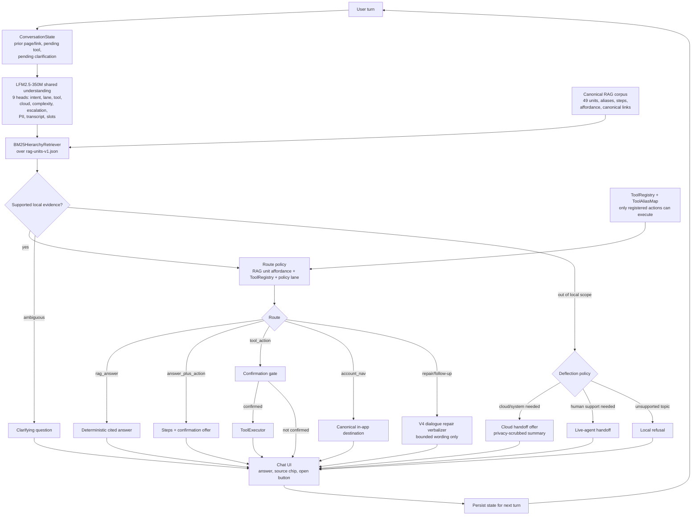

# Telco Triage iOS

Telco Triage is a SwiftUI reference app for an on-device home-internet support
assistant. It demonstrates a local, grounded agent flow for carrier support:
retrieve the right support unit, decide whether the user asked a question or a
safe action, render a cited answer, and only hand off when the request is outside
the local support boundary.

The current runtime uses **one LFM2.5-350M shared understanding pass** to read
the user turn, then keeps answer grounding under Swift policy control: a
canonical RAG corpus, state-aware BM25 retrieval, explicit tool/handoff gates,
and a deterministic composer for cited support answers. A bounded V4 dialogue
repair verbalizer is available for follow-up turns such as "I can't find it" or
"that didn't work"; it verbalizes the already-selected state and never chooses
tools, citations, routes, or handoff policy.

- **Target**: `TelcoTriage`
- **Bundle ID**: `ai.liquid.demos.telcotriage`
- **Deployment target**: iOS 17 on device; simulator builds use the project
  override in `project.yml`
- **Display name**: `Telco Triage`

## Runtime Flow



## What Runs Online

Normal support Q&A uses:

- **Understanding forwards**: 1 shared LFM2.5-350M pass
- **Understanding artifact**: `telco-shared-clf-v1` + 9 classifier heads
- **First-turn answer generation calls**: 0
- **Dialogue repair generation**: optional, only for repair/follow-up wording
- **Retriever**: `BM25HierarchyRetriever`
- **Answer layer**: `DeterministicAnswerComposer`
- **Citation source**: selected `RAGUnit.canonicalURL`

The LFM decides compact understanding labels; Swift policy decides route,
source, tool safety, confirmation, and handoff. The verbalizer never invents a
source link or executes an action.

## What Ships In This Example

| File | Role |
| --- | --- |
| `TelcoTriage/Resources/rag-units-v1.json` | Canonical support corpus used by the current retriever/composer path. |
| `TelcoTriage/Resources/page-link-table-v1.json` | Canonical link table for source chips and in-app destinations. |
| `TelcoTriage/Resources/knowledge-base.json` | Small sample KB retained for non-composer demo surfaces. Not the current RAG source of truth. |
| `TelcoTriage/Resources/Models/lfm25-350m-base-Q4_K_M.gguf` | Base LFM2.5-350M model, copied locally by `bootstrap-models.sh`. |
| `TelcoTriage/Resources/Models/telco-shared-clf-v1.gguf` | Shared understanding adapter for the 9-head single-forward pass. |
| `TelcoTriage/Resources/telco-*_classifier_{weights,bias,meta}` | Classifier head projections for intent, lane, tool, cloud, complexity, escalation, PII, transcript, and slot-completeness labels. |
| `TelcoTriage/Resources/telco_shared_clf_schema.json` | Label schema consumed by the shared understanding runtime. |
| `TelcoTriage/Resources/Models/telco-dialogue-repair-v4.gguf` | Bounded dialogue repair verbalizer for selected multi-turn repair/follow-up acts. |
| `TelcoTriage/Resources/Models/telco-tool-selector-v3.gguf` | Tool-support adapter for ambiguous local action paths. |

Large GGUF files are intentionally not committed to the cookbook. Download them
from the private Hugging Face model pack or place them in
`examples/telco-triage-ios/models/telco/`.

## Run Locally

Requirements:

- Xcode 15+
- `xcodegen`
- Hugging Face CLI (`hf`) if downloading the private model pack

Install XcodeGen if needed:

```bash
brew install xcodegen
```

Download model artifacts from the private model pack:

```bash
hf auth login
hf download "$HF_REPO_ID" \
  --include "*.gguf" \
  --local-dir models/telco
```

Then prepare and open the app:

```bash
cd examples/telco-triage-ios
./bootstrap-models.sh
xcodegen generate
open TelcoTriage.xcodeproj
```

If your GGUFs live elsewhere:

```bash
TELCO_MODELS_DIR=/path/to/telco-models ./bootstrap-models.sh
```

## Validation

Current-runtime smoke tests:

```bash
cd examples/telco-triage-ios
xcodegen generate
xcodebuild test \
  -project TelcoTriage.xcodeproj \
  -scheme TelcoTriage \
  -destination 'platform=iOS Simulator,name=iPhone 17 Pro' \
  -only-testing:TelcoTriageTests/AnswerComposerTests \
  -only-testing:TelcoTriageTests/BM25HierarchyRetrieverSwiftParityTests \
  -only-testing:TelcoTriageTests/ChatViewModelIntegrationTests \
  -only-testing:TelcoTriageTests/ConversationRecoveryTests \
  -only-testing:TelcoTriageTests/ConversationStateTests \
  -only-testing:TelcoTriageTests/MultiTurnIntegrationTests \
  -only-testing:TelcoTriageTests/MultiTurnRetrievalAugmentationTests \
  -only-testing:TelcoTriageTests/ToolExecutorTests \
  -only-testing:TelcoTriageTests/VerizonDispatcherComposerPathTests
```

The regression tests assert that the single-forward understanding layer is used,
the composer path stays grounded, citations remain canonical, confirmation
gates execute only pending safe actions, and multi-turn repair/follow-up turns
reuse state without letting the verbalizer choose routes or links.

## Demo Prompts

```text
How do I restart my router?
I can't find the restart button
Can you turn Wi-Fi off from my son's tablet?
Can you tell me how to do it?
Where is the equipment tile?
How do I change my Wi-Fi password?
Run a speed test
Is there an outage in my area?
I want to talk to a person
Ask something off-topic
```

## Customizing For Another Carrier

1. Regenerate `rag-units-v1.json` from the carrier's support material.
2. Preserve the runtime fields: `page_id`, `title`, `section`, `aliases`,
   `steps`, `body`, `link_id`, `canonical_url`, and `action_affordance`.
3. Add production phrasings to the alias layer with provenance.
4. Register only tools the app can actually execute in `ToolRegistry`.
5. Map corpus `link_id`s to tool intents through `ToolAliasMap` only when the
   tool exists and its confirmation policy is explicit.
6. Define handoff policy for local refusal, cloud/system handoff, and live-agent
   escalation.

## Hugging Face Delivery Pack

This example includes packaging scripts under `hf/`:

```bash
./hf/prepare-hf-bundle.sh
HF_REPO_ID=LiquidAI/TelcoTriage-POC ./hf/upload-hf-bundle.sh
```

The prepared bundle contains the GGUFs required by the app, the canonical RAG
resources, a manifest, checksums, and a customer-facing model card.
